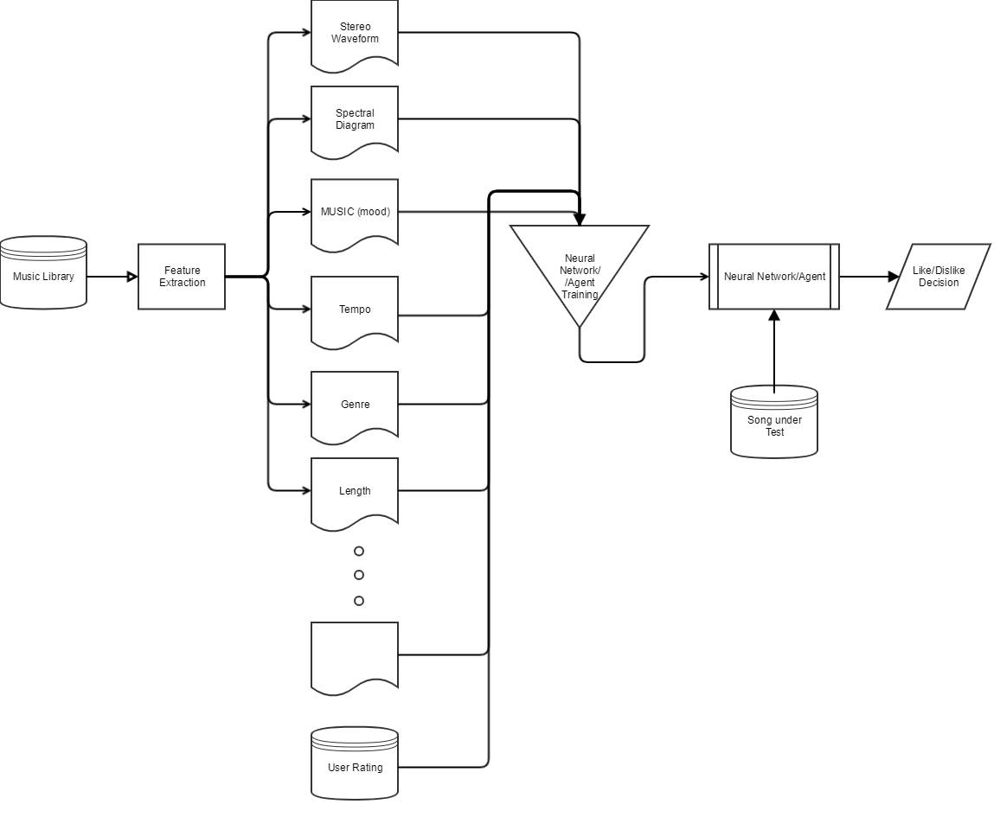

# Machine Learning Engineer Nanodegree
## Capstone Proposal
Mark Aligbe
January 4th, 2019

## Proposal

##### A Music Taste Profiler: A Content-Based Music Recommender #####

### Domain Background

Collaborative filtering (CF) methodologies are the de-facto standard of music recommendations. These systems rely on users to rate their music, and then learn similar users and suggest music based on the intersection of similar users. In this system, users rate songs according to their preferences. For songs a user hasn't rated, the system will determine which other users are similar in preferences to this initial user, and then a weighted rating is estimated for songs the initial user hasn't listened to that the other users have.

A simple way to look at it is demonstrated in this [image](https://thumbs.gfycat.com/ImperturbableAdvancedHorsefly-size_restricted.gif):

Other approaches to music recommendation exist. The other broad category of recommenders is content-based (CB) recommenders. These systems analyze various aspects of music in order to provide ratings. These aspects can include metadata like the artist, album, genre, year of release, the spectrogram of the audio [^fn2], as well as the actual audio. Some recommenders take a hybrid approach, where features computed using CF [^fn3], like latent factors of artist popularity, are used as input into to the content based recommender. Our goal is to create a CB recommender without relying on features computed using a CF pipeline.

### Problem Statement

The reasons for eschewing collaborative filtering are its failure modes. CF fails for new songs, or for songs which are unpopular - either in that few users have heard the song or most users do not like the song. New/rarely listened to songs do not have many ratings, which means finding users that match the preference of other users will be hard, this is the so called cold-start problem. Even in the case that there are a few users that align well, the confidence of such a rating will be small. In the other meaning of unpopular, if a song is listened to a lot but is generally panned (has a low rating), then the recommender may fail to identify users who would appreciate the song. This problem is pertinent to the author, because his preferred songs fall into this category which means content-based recommender systems usually recommend songs that the author is not interested in, while withholding songs that the author prefers.

Content-based recommendation does not suffer from these failure modes. It is not as prevelant in usage because CB recommenders generally perform worse than their CF counterparts[^fn9]. However, this is the best approach for the cold-start problem. To simplify the task of the recommendor, it will be a binary classifier where "true" means that the user will like the given input song, and "false" means that the user will not like the given input song. The song file (and whatever metadata it may contain) will be the only input to the CB recommender.

### Datasets and Inputs

As collaborative filtering fails for the author, the dataset for this assignment will largely consist of the author's own music library. This library will be made available for use for verification of results with submission of the completed project. The songs in the library are generally 3-4 minutes long and are of high fidelity. Most genres of music are covered, with some skewed genre representation. Most songs are in stereo, with a few songs in mono. Some experimentation will be done to standardize the input, such as converting multi-channel to mono and sample rate conversion.

From my library, 1500 positive samples and 3000 negative samples will be chosen. There are an additional 5500 samples of unknown classification. The negative samples are capped to the 2x the positive samples to avoid training on too skewed data. The positive samples consist of songs which have a play count greater than 5. The negative samples consist of songs that are present in my archive, but not in my library, indicating that I have listened to them and did not want them in my library at all. The unknown samples broadly consist of songs I haven't listened to at all, haven't listened to closely, or feel indifferent towards. These unknown samples can be used as a test set or to supplement training once classified.

Additionally, songs and users will be used from the Million Song Dataset[^fn1] to analyze the robustness of the solution, time permitting.

### Solution Statement

The hope of content-based recommenders is to allow the system to bridge the semantic information of the audio to the user preference. Using content-based recommenders offers a solution to recommending unpopular or new songs to users. 

With the success of neural networks in many domains, we will also leverage neural networks in our solution. We believe neural networks will be our best attempt at bridging the semantic gap of audio content to user preference. To feed the audio data into the neural network, we will experiment with a few different approaches. First is the choice(s) of how to represent the data such as raw PCM data or spectral representations, which will lend itself to using convolutional neural networks. The time span of the representation is also a point of testing, as well as whether to use multiple, random slices. As discussed in the [Datasets](#datasets-and-inputs) section, various standardization options of the input will also be tested. As will be discussed in the [Project Design](#project-design) section, we will extract features from this pre-processed data. 

### Benchmark Model

To compare the performance of our neural network based implementation, we will code a k-NN based classifer[^fn10].

While the standardization of the audio input will be similar, some feature/preprocessing can't be mapped one-to-one in the context of k-NN. For example, while we could feed the raw pixel values of a spectrogram to the k-NN, this could possibly be a noisy feature for it. The work in [^fn10] provides a list of features that have been applied to this specific approach in "Table 1: Computed audio features". Some of these features are the BPM of the song, the key scale, the silence rate at various dB thresholds, and more.

It would also be interesting to compare our performance against other literature, time permitting. For example, a Spotify (a music streaming platform) intern sought to apply neural networks to the problem of content-based music recommendation[^fn2]. Some other neural network approaches involve using latent factors derived from user preference data have been shown to be successful[^fn3][^fn4], and other techniques use purely music information retrieval (MIR) to achieve good performance in cold-start environments[^fn5], like our approach.

### Evaluation Metrics

The main metric will be the [ROC Area Under Curve](http://gim.unmc.edu/dxtests/roc3.htm).

In AUC, the true positive rate is plotted against the false positive rate for increasing classification percentage cut-offs. A classifier that follows the upper left corner generally performs better than classifiers that more closely follow the middle-dotted line. AUC is a generally useful metric of performance of classifiers[^fn6][^fn7][^fn8].

Of importance is also minimizing the false positive rate; we weigh recommending a song that is actually disliked to be worse than saying we would dislike a song that we actually prefer. As such, we want an architecture with high precision. This will be another metric to measure the performance of our model and benchmark.

### Project Design

The Music Taste Profiler project will be a task of combining [music information retrieval](https://en.wikipedia.org/wiki/Music_information_retrieval) with state-of-the-art classification architecture.

The Music Taste Profiler will be a neural network architecture and/or reinforcement learning agent (hereon referred to as "profiler") that will be trained on a music library. The songs in this library will undergo feature extraction, outputting various vectors. Some sample vectors have been illustrated in the architecture picture above.

Using these features and the user rating of songs, the profiler will be trained on the predictive task of determining whether this user will like or dislike a given song (the "Song under Test").

#### Music Library

This will be the per-user input into the profiler. Each user will be trained individually; a profiler for a user will not necessarily be applicable to a different user. The songs will undergo simple pre-processing at this step to standardize the input to the feature extractors:

- All songs will be converted to stereo
- All songs will be converted to 16-bit simple PCM encoding

Additional experimentation will be done to determine what additional preprocessing should be applied to songs entering feature extraction (truncating, speeding up, taken random subsets, reducing bit-depth, etc.) with a focus on speed of training vs. accuracy tradeoff.

#### Feature Extraction

Feature Extraction in this project will be the process of judiciously applying existing MIR tools and trying out new approaches. Some resources that will be explored are listed here:

https://www.ismir.net/software-tools.php

with a particular focus on [Marsyas](http://marsyas.info/) and [jMIR](http://jmir.sourceforge.net/overview.html). These tools can provide semantic information like the assumed genre of the song, its tempo, or various mood qualifiers of the track

Some other features that can be extracted from audio that may or may not be explored:

- The spectral time-lapse of audio (as in [^fn2]).
- Band-/low-/high-pass filtering + weighted summation (e.g. how much of a song's spectral energy lies around 200 Hz)
- FFT representations of the tracks

Additional potential features are displayed in the project architecture image. In particular, MUSIC (mood)[^fn5] may be extracted using jMIR. Finally, Table 1 of [^fn1] provide a good set of computed features to sample.

#### User Ratings

User ratings provide an additional dimensionality for the profiler. The originally proposed music set has recommendations ranging from 0-5, which represent the relative specialness of a song. A rating of zero does not mean a song is disliked, merely that it is "standard liked". Ratings of 1 or higher distinguish a song as being better than others. These ratings may be useful as inputs into the reward function of a reinforcement learning agent, but its applicability outside of reinforcement learning seems lacking. Exploring using solely a neural network architecture or reinforcement learning is also an objective of this project.

#### Neural Network/Agent Training

While neural network architectures have been applied to this problem with success[^fn2][^fn3][^fn4][^fn5], it is possible that neural networks coupled with reinforcement learning can perform even better. A task for exploration will be evaluating a neural network classifier (or even more traditional classifiers like SVDs) compared to a reinforcement learning trained classifier.

Convolutional neural networks have been applied to latent factor[^fn3][^fn4] classification; however, we are not using such features. The Spotify intern demonstrated success using a CNN for analyzing the spectrogram of the music[^fn2], so perhaps CNNs can be a layer in the overall model architecture of the neural network.

This architecture of the neural network (actor/critic, or sole classifier) will be the main point of exploration. How many layers to use, what inputs to feed to which layers, and what type of layers will be explored.

#### Prediction

The final output of the model will be a like/dislike decision when fed a song. The song will go through pre-processing and feature extraction, and the profiler will output a Boolean saying whether the user will like this song.

This will not be a rating of the song. A point of experimentation may be to take the raw signal of the output and attempt to rate the song, but the primary objective of the profiler is to confidently state whether the given user will like the given song.

### Miscellaneous

Million Song Dataset retrieval links:
https://labrosa.ee.columbia.edu/millionsong/tasteprofile
https://labrosa.ee.columbia.edu/millionsong/pages/getting-dataset

[^fn1]: https://labrosa.ee.columbia.edu/millionsong/pages/getting-dataset
[^fn2]: http://benanne.github.io/2014/08/05/spotify-cnns.html
[^fn3]: https://papers.nips.cc/paper/5004-deep-content-based-music-recommendation.pdf
[^fn4]: https://arxiv.org/pdf/1807.06786.pdf
[^fn5]: http://www.cs.uu.nl/groups/MG/multimedia/publications/art/icme2015-preference.pdf
[^fn6]: https://towardsdatascience.com/understanding-auc-roc-curve-68b2303cc9c5
[^fn7]: https://www.medcalc.org/manual/roc-curves.php
[^fn8]: https://developers.google.com/machine-learning/crash-course/classification/roc-and-auc
[^fn9]: https://www.slaney.org/malcolm/yahoo/VisionAndViews/Spring2011-DoesContentMatter.pdf
[^fn10]: https://tampub.uta.fi/bitstream/handle/10024/101198/GRADU-1495623946.pdf