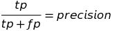
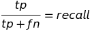
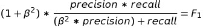
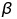
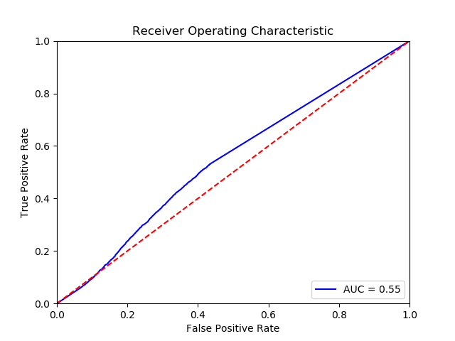
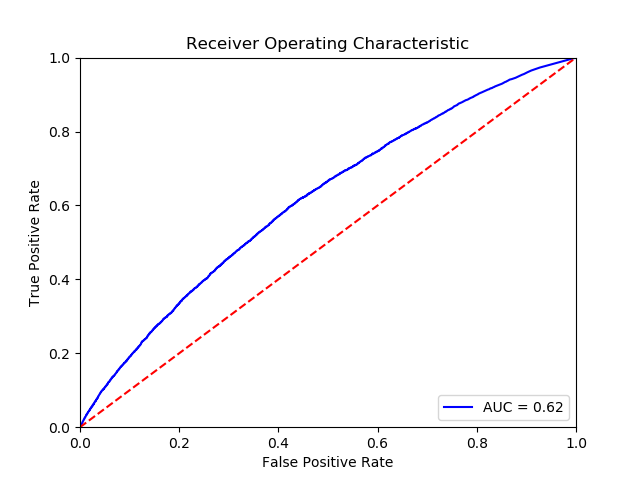
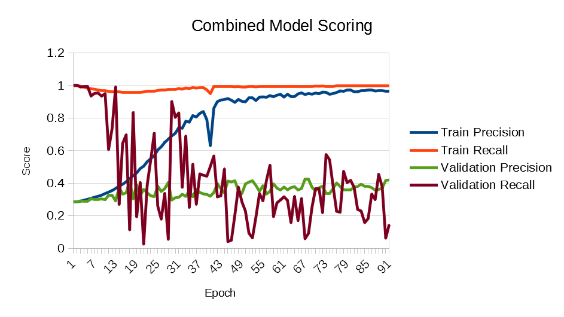
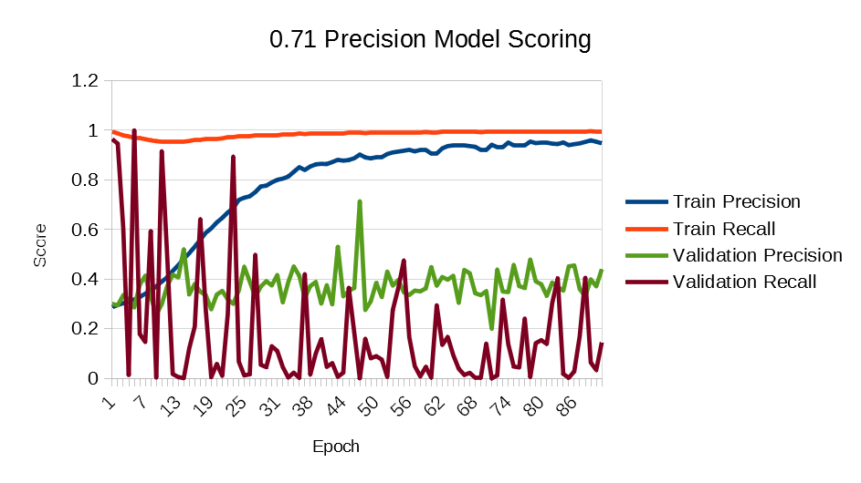

# Machine Learning Engineer Nanodegree
## Capstone Project
Mark Aligbe
March 2nd, 2019

## I. Definition

### Project Overview

Collaborative filtering (CF) methodologies are the de-facto standard of music recommendations. These systems rely on users to rate their music, and then learn similar users and suggest music based on the intersection of similar users. In this system, users rate songs according to their preferences. For songs a user hasn't rated, the system will determine which other users are similar in preferences to this initial user, and then a weighted rating is estimated for songs the initial user hasn't listened to that the other users have.

A simple way to look at it is demonstrated in this [image](https://thumbs.gfycat.com/ImperturbableAdvancedHorsefly-size_restricted.gif):


Other approaches to music recommendation exist. The other broad category of recommenders is content-based (CB) recommenders. These systems analyze various aspects of music in order to provide ratings. These aspects can include metadata like the artist, album, genre, year of release, the spectrogram of the audio [^fn2], as well as the actual audio. Some recommenders take a hybrid approach, where features computed using CF [^fn3], like latent factors of artist popularity, are used as input into to the content based recommender. Our goal is to create a CB recommender without relying on features computed using a CF pipeline.

### Problem Statement

The reasons for eschewing collaborative filtering are its failure modes. CF fails for new songs, or for songs which are unpopular - either in that few users have heard the song or most users do not like the song. New/rarely listened to songs do not have many ratings, which means finding users that match the preference of other users will be hard, this is the so called cold-start problem. Even in the case that there are a few users that align well, the confidence of such a rating will be small. In the other meaning of unpopular, if a song is listened to a lot but is generally panned (has a low rating), then the recommender may fail to identify users who would appreciate the song. This problem is pertinent to the author, because his preferred songs fall into both these categories of unpopular which means content-based recommender systems usually recommend songs that the author is not interested in, while withholding songs that the author prefers.

Content-based recommendation does not suffer from these failure modes. It is not as prevelant in usage because CB recommenders generally perform worse than their CF counterparts[^fn9]. However, this is the best approach for the cold-start problem. To simplify the task of the recommendor, it will be a binary classifier where "true" means that the user will like the given input song, and "false" means that the user will not like the given input song. The song file (and whatever metadata it may contain) will be the only input to the CB recommender.

Our content-based recommendation system will use a neural network to attempt to understand characteristics of the music to what is considered a good song versus what is considered a bad song. In order to train and predict the neural network, we will extract various high-level features representing different characteristics of the song.

### Metrics

Of importance to us is that the model have high precision. We want the model to be confident that a sample it considers good, is in fact, good. The formula for precision is given as follows:



It can be thought of the ration of true positives to all positives predicted by the classifier. As the number of true positives increases, the precision score approaches 1. As the number of false positives increases, the precision score approaches 0. A high precision means that the classifier is only returning relevant results; i.e. songs that the user actually desires.

High precision, while the goal, is only half of the story. Being able to identify all such good songs is important. This is represented by the recall metric:



Recall can be thought of the ratio of how many relevant results were predicted. False negatives are songs the classifier considered bad, but the user would have liked. Thus, a low recall means that the classifier has many false negatives, and is being too discriminating with the music selection. On the other hand, a high recall means that there are a low number of false negatives, and that the classifier is correctly predicting positive samples.

A combined metric is called the F1 score, which optionally weights the precision and recall scores:



The 1 in F1 indicates the value of . When is less than 1, the F1 score will be more sensitive to precision. We set to 0.5.

While we value precision more than other metrics, we do not want to abandon recall entirely. Having a high precision with no recall essentially means that our classifier will classify most songs as bad, even though our taste is not as critical. In our empirical testing, we found that `F_0.5` responded to high recall values too much, so a combined metric of:

```
recall * F_0.5 = combined
```

Is used to provide improve the importance of precision, but at the same time penalize a precision with a very low recall.

In addition to these metrics, the final chose neural network will be analyzed using ROC AUC:


In AUC, the true positive rate is plotted against the false positive rate for increasing classification percentage cut-offs. A classifier that follows the upper left corner generally performs better than classifiers that more closely follow the middle-dotted line. AUC is a generally useful metric of performance of classifiers[^fn6][^fn7][^fn8]. This will enable an apples-to-apples comparison of our classifiers to other literature that publishes these results.

In summary, the metrics of interest are the `F1` (`F_0.5`) score, the precision, and the combined metric.

## II. Analysis

### Data Exploration

The songs used for training and prediction consisted of songs from my own personal library. Here, I will describe the selection and transformation process for those songs.

Foobar2000, in addition to being a music player, provides extensive querying capabilities over an entire music library. A decisive metric it provides us is the number of times I've listened to a song. I eliminate songs I do not decidedly enjoy after a few listens, therefore songs that remain in my active playlist tend to be songs that I enjoy. This excludes songs for which I haven't passed judgement on, or songs I simply haven't listened to yet. Thus, songs that had been listened to at least 6 times were categorized as "good". This yielded 1601 songs.

Additionally, when I remove songs from my library, I do not delete the digital media. This allowed me to perform the set difference of songs I enjoy, songs I haven't listened to, and songs that I do not enjoy. My active playlist is the set of songs I enjoy joined with the set of songs I haven't listened to. The task was then to produce a list of songs in my digital archives, that are not in this other set. For this task, foobar2000's SQL Query feature was also used. Some additional filtering using foobar was also performed on these songs:

- Short ("TV Edit") versions of songs that were in the good playlist were removed
- As a design choice, "vocal-less"/karaoke versions of songs were kept. While there is overlap in the melody of these two versions, the author does not likes these songs, and it is significant that despite these similarties, the author dislikes this kind of song.
  - There are 313 such songs
- Duplicate songs were removed
- Multi-track files were removed

This filtering yielded 4025 songs.

### Exploratory Visualization, Algorithms and Techniques

#### Mel Spectrogram

There are many high-level features to extract from music. The foremost feature is the mel spectrogram:

.

A contextual explanation of the mel spectrogram is of a binned FFT with a head transfer function applied. The distinctive feature of the mel spectrogram is this "head transfer function", which is a log transformation based on a qualitative assessment of loudness judged by [human listeners](https://en.wikipedia.org/wiki/Mel_scale). Mel spectrograms have been used successfully for speech recognition[^fn11]. It was intended to use a simple binned representation of the FFT as a feature for our model, but further research yielded discovery of the Mel Spectrogram.

#### Chroma Spectrum

Another representation of the FFT, the chroma spectrum uses the traditional 12 note octave as the bins and applies windowing over the various pitches for each note contained in the FFT:


The chroma spectrum decomposes complex tracks into an oversimplified version of sheet music. This feature hopes to serve as a transformation of a noisy `2^n` dimensional space (where `n` is the bit-depth of the track) into a simpler, but still semantically rich, 12 dimensional space.

#### Spectral Flux

To characterize the variance of a track (variance in the sense of semantic sense, not the statistical sense), a few features were extracted. The first is the spectral flux. This is a measurement of the difference between the power of the mel spectrogram between time `t` and `t-ε`, averaged over all frequencies:


This can be visualized in the Mean (mel) displayed below (spectrogram provided for reference):


The spikes sync roughly to quick color gradiations in the power spectrogram.

#### Contrast

Spectral Contrast is a feature created by Dan-Ning Jiang et. al.[^fn12]. Spectral contrast serves as another transformation of an FFT, but is more closely related to the chromaspectrum. Additionally, an analogue to onset detection (spectral flux) is used in determining the value of each octave bin, as opposed to summing up the bins as in a mel spectrogram. Finally, a Karhunen-Loeve Transform is performed in place of a DCT, but as the authors note, this is for the same reason that a DCT is performed; to remove relativity from the extracted features. A plotted contrast looks like:


One can see the trend that the more consistent regions in the power spectrogram have a lower computed contrast. Thus, we can surmize that the contrast achieves the semantic goal of its namesake.

#### Rolloff

This feature indicates at what frequency a given percentage of energy is contained in that frequency and below for a particular sample window:


The hope of using this feature is to ascertain how the significant power content of the sample changes over time, as this is what a human listener might be following. The target percentage was 85%.

#### Tempo and RMS (Fractional)

For the sake of brevity, I'll discuss these two relatively simpler features in the same section. The [tempo](http://librosa.github.io/librosa/generated/librosa.beat.tempo.html) is computed based on the frequency of the onset function (spectral flux). The RMS is computed from the FFT of the song for each window. Of interest in our proposal is the significance of the 200 Hz region of a song. This is represented by computing how much of the RMS is due to frequencies around this range. Frequencies above 300 Hz and below 100 Hz of the FFT were zeroed out, and then the RMS computed again. This windows RMS was then divided by the full RMS to yield a fractional RMS; the ratio of how much energy of the total signal is due to this frequency range.

### Benchmark

As had been discussed in the proposal, a k-NN was the desired benchmark model. However, the training time for such a model appeared unbounded. Giving the k-NN the same features and training base as the neural network kept a 20-core machine going for a full 24 hours. As a result, a different benchmark model was selected. A decision tree was chosen as the final benchmark classifier. A search of literature indicated that the primary use case of decision trees in music classification is for genre classification[^fn13][^fn15], speech/audio classification[^fn14], and other non-preference domains. There has been at least some work using decision trees [^fn16], and the results are impressive, so this can be a competitive model to our neural network implementation. The combined metric, precision, and AUC wil be analyzed for the benchmark and neural network implementation.

## III. Methodology

### Data Preprocessing

After separating the song library into 1601 good songs and 4025 bad songs, we standardized the format of all the songs. This standardization included converting all files to stereo, converting all files to 16-bit depth, converting all files to a sample rate of 44100 Hz, and converting to a lossless format (AIFF). All conversions were handled with foobar2000.

A design decision was made at this point to analyze songs in 5 second samples, so as not to blow up the input vector size. To compensate for this, for each song, 30 samples were extracted randomly and all of them are trained on.

Finally, for computing the features of each sample, the track was mixed down to mono.

### Implementation

#### Song Sampling

We use `pydub` to read the AIFF file, and then we select up to 30 random starting points from the sample (or less, if the song is less than 5 seconds long). We then extract 5 seconds worth of samples from the starting locations and save them in a database.

A variety of different databases and storage formats were tried to find one suitable for storing such a large collection of samples. This was about 7 different days worth of effort.

#### Feature Extraction

After sampling the songs, we send the samples into feature extraction. We use `librosa`, a python package for music information retrieval. The images in the previous section were obtained from `librosa` documentation pages. All features mentioned in the "Exploratory Visualization" section were used as features in implementation.

The features all operate on a window of samples within each sample. The window length was chosen as a power of 2 to enable computation of FFts and their dependent features. Additionally, a window size was chosen such that the Nyquist frequency of the FFT would be sufficiently high, `32768/2 = 16384 Hz`. This results in 7 timesteps for each feature computed, with the exception of tempo, which is a holistic feature.

After creating the samples, they were sent into a computational pipeline to compute all of the features and store them in a persistent file format. For our dataset and training size, we were able to use `pyarrow` to persist the feature vector for each sample.

Exploring different music information retrieval tools was also part of this effort, in addition to understanding the features to be extracted. jAudio and Marsys were both considered, before I found `librosa`. In terms of speed, `librosa` eclipses both other services, partially because of the in-process computation. This was about 3 different days worth of effort.

Additionally, all features were normalized such that all parameters had an absolute value of 1.0 or less. This was done by dividing by the maximum element in the feature's vector, sample-wise, with the exception of the fractional RMS value and the tempo. The RMS value is normalized virtue of its computation, and for tempo we simply selected a value higher than any measured tempo in our sample database.

The initial version of the feature extraction pipeline used a `keras` `Sequencer` to feed data directly to the neural network model. This was slow, and initial attempts to resolve this involved using RAM disks and getting larger amounts of system RAM. This was about 4 days worth of effort

#### Feature Transformation

After extracting the features, we re-construct the data structure into a format that `keras` can consume. We then save the final model input for quick model iteration.

After discovering that the training time was being bottlenecked by transforming the features, I decided to just pre-compute all the features. This was infeasible due to the large file size (26 MiB per sample) of the features created using `pickle`, but two optimizations made this feasible. Using `pyarrow` provided a lot of compression on the features (407 KiB per sample), and also serializing the entire training/validation/test data structure reduced duplication of serialized information. This effort took about 2 days worth of effort.

#### Neural Network

The final neural network is a heterogenous system.

Each feature has its own input neural network. For 1D (tempo) and 2D (RMS, Flux, Rolloff) features, two dense layers were used. For the 2D features, the second dimension is time. For 3D features (Mel, Contrast, Chroma), a 1D convolutional network was applied to the feature, to learn specific characteristics of that feature.

Finally, all of these networks were concatenated in a single layer, and another 2 hidden layers learned their interactions, before the final output layer. This approach was consistent throughout the life span of the neural network.

For training the neural network, we use the `Adadelta` optimizer in `keras`, which is puported to improve learning even after many updates had been performed. We went with `Adadelta` due to the number of training samples, and that each training sample represents a different part of each song. For optimizing the loss function, we used the `logcosh` function as it's a [proper scoring rule](https://en.wikipedia.org/wiki/Scoring_rule#Proper_scoring_rules). The metrics we report on each and every epoch are the precision, accuracy, recall, and combined metric of the validation set. Additionally, we weight the classes differently for computing the loss in back-propagation; to make sure that the neural network has high precision, we penalize errors in mis-classifying true labels as not good.

#### Decision Tree

Grid search was used to determine the optimal parameters of the decision tree. The tree was trained and scored using the same training and validation set as the neural net. The features of the neural net were flattened before feeding to the tree, but were otherwise unmodified. The parameters of interest, chosen by grid search were:

- Max Tree Depth: 30
- Class Weight: {0: 0.125, 1: 1}
- Max Features: "auto" (sqrt of the number of samples)

### Refinement

The neural network underwent many different tweaks to try to improve performance. Unfortunately, due to the time constraints, and the consistent crashes of my training system, I do not have a good log of the performance of various incarnations of the neural network. Some of the modifications consist of:

- Various different class weights (weighting the negative class stronger brought precision and recall down to 0)
- A flat neural network structure, using 5 layers (the best precision was 0.31)
- Using a few other features (memory requirements exploded)
- A third hidden layer in the heterogenous model (the model was more prone to overfitting)
- Dropout probabilities of 0.75, 0.5 and 0.25 (reducing the dropout increased validation performance).

This process of creating the neural network, of setting up the hardware, consisted of 3 different days of effort

## IV. Results

### Model Evaluation and Validation

Both the benchmark and the neural network were trained on the same set of data. While the training set was fixed, both sklearn's `GridSearchCV` and keras' `model.fit` perform random shuffling of the data on every training iteration. We found the performance of the models to be relatively invariant to the permutations of training data they were given.

Additionally, 30% of the data was also held out of training. Keras provides a simple validation argument to test the model on data it has not trained before. In the case of sklearn, we had to manually score the model with our validation set, as it performs shuffling of the total training and validation set, which was undesireable for consistency.

All iterations of the neural network were trained for at most 500 epochs, or until overfitting became apparent and further improvements in the validation score were not seen. I went through a few different versions of the neural network (included in the repository), before arriving at this final version. The noteworthy feature of this iteration of the neural network is that it is less prone to overfitting, compared to other iterations of the heterogenous network. It is also worth remarking that early iterations of the flat, homogenous neural network was prone to overfitting very rapidly, whereas the final version displayed signs of underfitting.

As for the results, we will begin with the AUC ROC of our benchmark model, the decision tree:



And follow that with the neural network:



We can see that the neural network performs better, with an AUC of 0.62 versus the benchmark's 0.55. This is not substantially higher, however. All in all, both models fall short of the performance displayed by [^fn16].

### Justification

Here are the precision, recall, F1 and combined metrics of the two models:

| Model | Precision | Recall   |   F1     | Combined |
|-------|-----------|----------|----------|----------|
| DTC   | 0.328858  | 0.530857 | 0.355947 | 0.117056 |
| NN    | 0.401956  | 0.335088 | 0.386529 | 0.155368 |

We see that the NN has much better precision, though much worse recall, than the decision tree. However, this tradeoff payed off with a distinctively better ROC curve, and a higher combined score. In reality, I would use the neural network over the decision tree classifier because I am more confident that its results as to whether or not I'll like a song are correct.

However, it's desirable for both of these models to be more discriminating. The metric for goodness still favors recall too much for a model with high precision to flourish. Of course, these two metrics are not mutually exclusive; it's simply a common tradeoff that many models have to make, including both of ours. With a precision of 0.40, it's very hard to trust the recommendation of such a system. This means that 40% of the songs it says are good (going back to the formula for precision) are actually considered good by the user.

## V. Conclusion

### Free-Form Visualization

Here, we present the validation and training precision and recall curves for the final chosen neural network, and another model with higher precision, but a lower combined score. First, the curves for the final chosen model:



As mentioned before, all neural network implementations (aside from the final iteration of the flat, homogenous model) were prone to overfitting. We can see the similar behavior with the high precision model:



Interestingly, as training precision and recall increases, there's very little discernable improvement in validation recall and precision. While there appears to be a gradualincline in the combined score model's performance, the noise around this slope renders that improvement moot. Better performing validation models are likely the result of an opportune oscillation between recall and precision.

The more or less constant nature of the precision score hints that whatever the model is learning about the training set is not relevant to the validation set. A deeper analysis of the features needs to take place to understand if this is a problem of features that are too similar to each other (unlikely) or features that aren't relevant to the semantic problem. I believe the latter case is the most likely outcome considering the low performance across all classifiers.

### Reflection

The creation of the neural networks and the decision tree classifier were certainly the easy part of this project. Everything else was the hard part.

Filtering out the songs, eliminating duplicates, and pruning out minor versions was tedious work, even with the help of SQL querying. Finding a good, embedded database that didn't leak memory was also hard, and the process of creating database wrappers was time consuming and non-productive. As the code shows for the leveldb database, I had to make my own crude database index. While making a database index is a novel experience, it was certainly one that seemed ancillary to the task at hand.

Creating the feature pipeline was exciting though. This decision was catalysed by discovering that I could not store pre-computed features in a database without consuming 1 GiB per song. With 5600 songs, I simply didn't have enough storage space for that. Thus, I decided to pay the penalty with computation time and memory, and managed to create a pipeline to take advantage of RAM disks and utilize all cores to the max. Sadly, this was not sufficient and still starved the GPUs.

After switching to an efficient `pickle` representation using `pyarrow`, training the models became less of a waiting game, and I was able to create meaningful models and iterate much quicker.

Due to time constraints, I was not able to iterate on the model parameters and feature definitions as much as I would like. The performance of the final model is below expectation, and it performs worse than a trivial classifier that always predicts I would not like a song (i.e. for our data set of 1601:4025, if it always predicts 0, it would be correct 72% of the time).

There are additional questions about the feature definitions, mainly are the features actually predictive, and are the good and bad samples relatively dissimilar. We identified 313 potentially overlapping songs, how similar (e.g. with a measure of euclidean distance) are feature vectors to each other? This was actually explored a little bit, and it was found that out of 10,000 samples, 20 were within 5% of the max dissimilarity to each other. We considered 20 out of 10,000 samples to be noise. We could not, however, compare more samples due to memory constraints.

But in summary, there are many open questions that need to be resolved before this model would be fit for general consumption.

### Improvement

Sadly, due to time constraints, I was unable to directly answer the question posed; will I like a given song? This neural network is trained to identify whether or not I'll like a random 5 second snippet of a song. It does not make any statement of the whole body of 30, 5 second samples. For this next level, another classifier needs to be trained on top of this. The input of this classifier would be the output of the neural network (or decision tree classifier) for each of the 30 samples, so the input is a `(30, 1)` feature vector. The output is then the class of the song, "good" or "bad". Simple heuristics could be applied to its results now, however. I.e. given 30 samples from a new song, if it says I like more than half the samples, then maybe I'll like the full song.

There were additional features that were not explored, of interest is the harmonic and percussive spectrum of the song (`HPSS`). This feature was as massive as the FFT, so for time constraints it was omitted.

The fact that the neural network also overfits readily warrants investigation. It _is_ learning something very well, and maybe the validation set randomly chosen just happens to lack this something. The flip side of this perspective is that it's possible the neural network has picked up on a very specific expression of the features that is only true of the training set, but my initial investigation into the euclidean distance of the feature vectors of the samples does not support that.

Given the performance of [^fn16], it would be helpful to know what features the TODO: Earl Gray database actually extracts from the audio to allow such a high quality decision tree classifier. That result is inspiring, and maintains hope for an effective content-based music recommender.

-----------

[^fn1]: https://labrosa.ee.columbia.edu/millionsong/pages/getting-dataset
[^fn2]: http://benanne.github.io/2014/08/05/spotify-cnns.html
[^fn3]: https://papers.nips.cc/paper/5004-deep-content-based-music-recommendation.pdf
[^fn4]: https://arxiv.org/pdf/1807.06786.pdf
[^fn5]: http://www.cs.uu.nl/groups/MG/multimedia/publications/art/icme2015-preference.pdf
[^fn6]: https://towardsdatascience.com/understanding-auc-roc-curve-68b2303cc9c5
[^fn7]: https://www.medcalc.org/manual/roc-curves.php
[^fn8]: https://developers.google.com/machine-learning/crash-course/classification/roc-and-auc
[^fn9]: https://www.slaney.org/malcolm/yahoo/VisionAndViews/Spring2011-DoesContentMatter.pdf
[^fn10]: https://tampub.uta.fi/bitstream/handle/10024/101198/GRADU-1495623946.pdf
[^fn11]: https://web.archive.org/web/20110717210107/http://www.wcl.ece.upatras.gr/ganchev/Papers/ganchev17.pdf
[^fn12]: http://citeseerx.ist.psu.edu/viewdoc/download?doi=10.1.1.583.7201&rep=rep1&type=pdf
[^fn13]: http://www.naturalspublishing.com/files/published/jxm53y92t66a62.pdf
[^fn14]: https://link.springer.com/content/pdf/10.1155%2F2009%2F239892.pdf
[^fn15]: https://www.trevorstone.org/school/MusicRecognitionDatabase.pdf
[^fn16]: https://sites.northwestern.edu/msia/2018/02/09/dj-random-forest-song-recommendations-through-machine-learning/